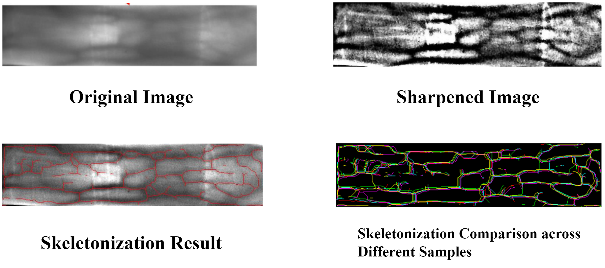
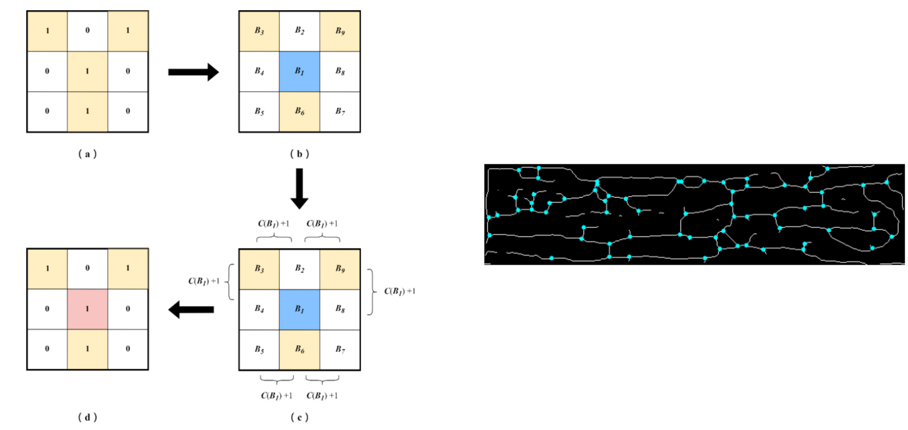
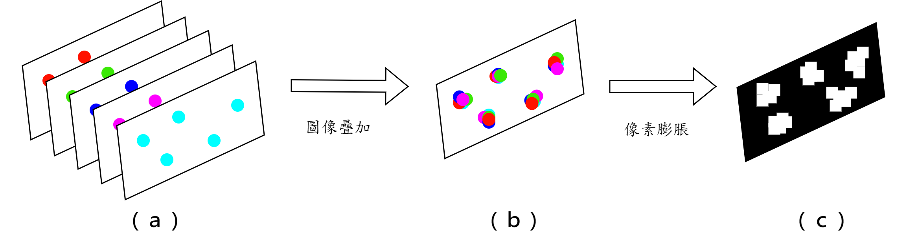
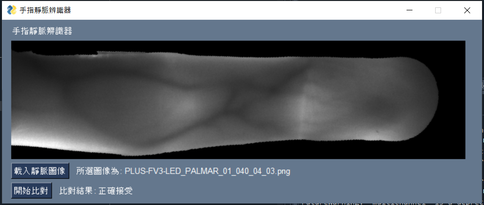

# finger-vein-recognition
This project involves a small-scale test using the Nelder-Mead method to validate the effectiveness of my image processing approach based on the PLUSVein-FV3 database. Please note that the implementation of the Nelder-Mead method is not included in this repository. For more details about the Nelder-Mead method, you can refer to [this project](https://github.com/yahfou/Nelder-Mead-method_python-version).
## Introduction
In this project, I tried various image processing techniques to skeletonize the vein patterns in finger images. Additionally, I employed a branching point detection algorithm to analyze the skeletonized vein patterns. For feature extraction, I overlaid five images of the same user's corresponding fingers to create a composite feature map, which was then used for matching tests.
### Features
**Image Processing Approach:** Utilizing traditional image processing techniques not only results in more intuitive and flexible features but also enhances compatibility with lower-performance devices.

**Branch Point Detection Algorithm:** Capable of accurately identifying branching points in vein patterns while disregarding endpoints of lines.

**Feature Set Overlay:** During the creation of the feature set, five images corresponding to the same user's individual fingers are overlaid to generate a comprehensive feature map. This process ensures irreversible high security and effectively saves database space.
## Requirements
* opencv-python 4.6.0
* scikit-image 0.19.3
* os
* numpy
* random
* re
* natsorted
* PySimpleGUI
## Descriptions
**Image Processing:** In this project, I primarily utilize a non-sharp mask to enhance the contrast of veins within the muscle tissue. This method is crucial for the subsequent skeletonization of vein patterns. Therefore, I employ the Nelder-Mead method to optimize the gamma value of the non-sharp mask, aiming to achieve the desired skeletonization results.The following presents a comparison between the original image and the sharpened result, along with the skeletonization results for five different samples of the same finger.

**Branch Point Detection Algorithm:** To detect branch points in the vein skeleton, this project employs an algorithm designed to identify and determine whether a pixel in the skeletonized image corresponds to a branch point. The algorithm operates by iterating over each pixel with a value of 1 in the skeleton image. For each target pixel, it checks the neighboring eight pixels in a counterclockwise direction around the twelve points in the compass rose. The algorithm identifies a branch point if there are six or more transitions in pixel values among the adjacent pixels.The following figure illustrates the process and the results of branch point detection algorithm.

**Feature Set Overlay:** After extracting the positions of branch points, we observed user-dependent shifts in different samples due to variations in finger placement on the device. To address this issue, we overlaid the five samples from the PLUSVein-FV3 dataset and performed dilation on the detected branch points. The resulting square region represents the spatial variation of branch points caused by different finger placements. The diagram below illustrates the process of creating the feature set.

## Usage
This project is based on the LED part images of the PLUSVein-FV3 dataset. Due to usage agreements and privacy considerations, the original dataset images are not included in this repository. You can personally apply and use the dataset from the [PLUSVein-FV3 website](https://wavelab.at/sources/PLUSVein-FV3/).

After obtaining the dataset, organize the necessary folders by downloading and extracting `all-dataset.rar` from this repository. Utilize `finger-vein-recognition_fold.py` to classify each finger for every user in the PLUSVein-FV3 dataset, with the outcomes stored in the `dataset` folder.Furthermore, populate the `test_dataset` folder with all finger images. Maintaining two similar folders facilitates a more detailed examination of variations among samples from the same finger while preventing confusion between different finger types.

Next, use `finger-vein-dataset_setup.py` to generate feature sets from the `dataset` folder and store them in the `feature_dataset` folder. Finally, use `finger-vein-recognition.py` for testing. You can experiment with different image processing methods, workflows, and parameters to adjust the processing results. Additionally, you can modify the alpha value to change the recognition threshold (typically, a higher threshold is used to tolerate false rejection rates and avoid more severe false acceptance rates).

